# Cloud-Computing-IAM
## Introduction

This mini project introduces us to Amazon Web Services (AWS) with a focus on Identity and Access Management (IAM). It assumes a basic knowledge of cloud computing, which is the delivery of IT resources like servers, storage, databases, networking, software, and analytics over the internet—helping businesses move faster, stay flexible, and cut costs.

In this project, I worked with a fictional fintech startup called Zappy e-Bank. This company represents a typical new player in the financial technology space, looking to use the cloud to innovate, grow quickly, and offer secure financial services. By using this scenario, saw how AWS IAM can be applied to manage users, permissions, and roles effectively, ensuring resources are accessed safely and efficiently.

## Why IAM Matters for Zappy e-Bank

As a fintech company, Zappy e-Bank must protect sensitive customer data and meet strict security standards. AWS Identity and Access Management (IAM) helps achieve this by controlling who can sign in and what resources they can use.

## With IAM, Zappy e-Bank can:

- Create and manage users and groups to securely control access.
- Use roles and policies to give specific permissions to people, services, or applications.
- Strengthen security with multi-factor authentication (MFA).
```
In this project, I'll set up IAM for Zappy e-Bank to build a secure, real-world-like environment. This hands-on work will teach you the basics of IAM, how to manage access properly, and best practices for protecting cloud resources.
```
## Creating IAM Users
```
An IAM user is like a digital identity in your AWS account. It represents a person or service and comes with specific permissions that control what they can and cannot do with AWS resources.

Think of your AWS account as a large, secure building. The root user is like having the master key—it can open every door, access every floor, and even change the locks. While powerful, it’s too risky to use every day because if it falls into the wrong hands, the entire building is exposed.

Instead, you create IAM users, which are like individual keys. Each key only opens the doors needed for a specific task—such as cleaning, maintenance, or security checks. This way, people or services get access only to what they need, keeping your AWS account safer and more controlled.
```
## Real-life Application
```
In this task, I created IAM users for two specific roles at Zappy e-Bank:
```
- John, who works as a backend developer, requires access to compute resources, specifically EC2 instances, to deploy and manage backend applications.
- 
- Mary, who is a data analyst, needs access to S3 storage to manage and analyze data effectively.
```
Rather than creating separate policies for each individual user, a more efficient approach is to:
```
- Develop a policy for each role that clearly defines the permissions required for that role.
- Create an IAM group corresponding to each role.
- Add users to the appropriate group, ensuring they inherit the correct permissions automatically.
```
This role-based approach simplifies the management of access permissions, reduces the risk of misconfiguration, and ensures that as the organization grows, all team members receive the proper level of access according to their responsibilities. It also aligns with best practices in AWS security by promoting consistency, scalability, and adherence to the principle of least privilege.
```
## Create policy for the Development team
```
In the AWS IAM console, navigate to the Policies section by clicking on Policies in the left-hand menu. This section allows you to view, create, and manage IAM policies, which define permissions for users, groups, and roles. From here, you can create new policies for specific roles, attach existing policies to users or groups, and ensure that each IAM user has the correct level of access according to their responsibilities.
```
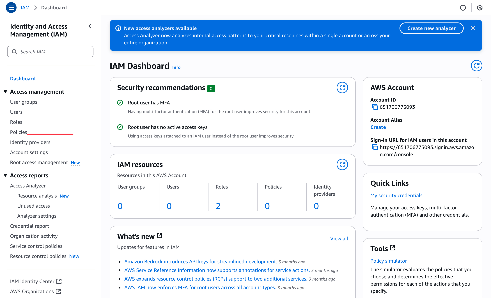
```
In the Policies section of the IAM console, click on Create Policy. This action initiates the process of defining a new IAM policy, where you can specify detailed permissions, including which AWS services and actions a user, group, or role is allowed (or denied) to perform. Creating a custom policy allows you to tailor access precisely to the requirements of a specific role, ensuring users have the correct permissions without overexposing resources.
```

```
In the “Select a service” section of the policy creation page, use the search bar to type EC2 and select it from the list of available AWS services. This step specifies that the policy you are creating will define permissions related to EC2 instances, such as launching, stopping, or modifying servers. By selecting EC2, you ensure that the policy is tailored to the needs of roles like a backend developer, granting access only to the relevant compute resources.
```

```
For simplicity, check the box labeled “All EC2 actions”. This grants full access to all available actions within EC2, including launching, stopping, modifying, and terminating instances. Selecting this option ensures that the user or role assigned to this policy can perform any EC2-related task without restriction, which is suitable for roles like a backend developer who requires complete control over server management.
```
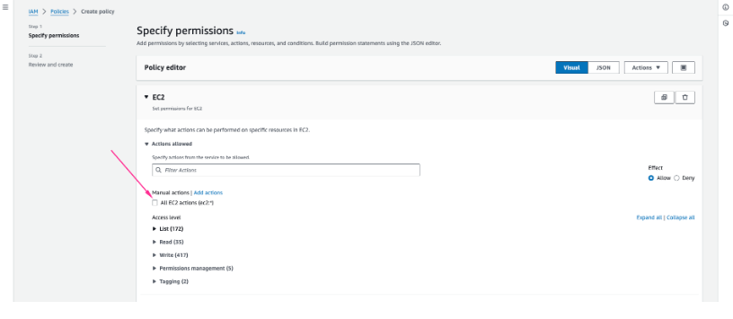
```
In the Resources section of the policy creation page, select “All”. This ensures that the permissions granted by the policy apply to all EC2 resources in the account, rather than restricting access to specific instances or components. By choosing this option, the user or role assigned this policy can manage any EC2 instance, volume, or related resource, providing full operational flexibility needed for tasks such as deploying, configuring, and maintaining backend servers.
```
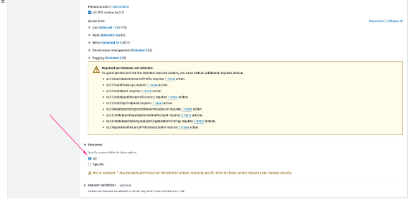

```Click Next```
After configuring the permissions for the policy, provide a name and description to clearly identify its purpose:

```Policy Name: Developer``` – This identifies the policy as intended for backend developers who require full access to EC2 resources.

```Description```: Grants full access to EC2 instances and related resources for backend development tasks. – This provides context for anyone reviewing policies in the future, explaining why the policy exists and what level of access it provides.
```
Giving clear names and descriptions helps maintain organized and understandable IAM policies, especially as the number of users and policies grows.
```
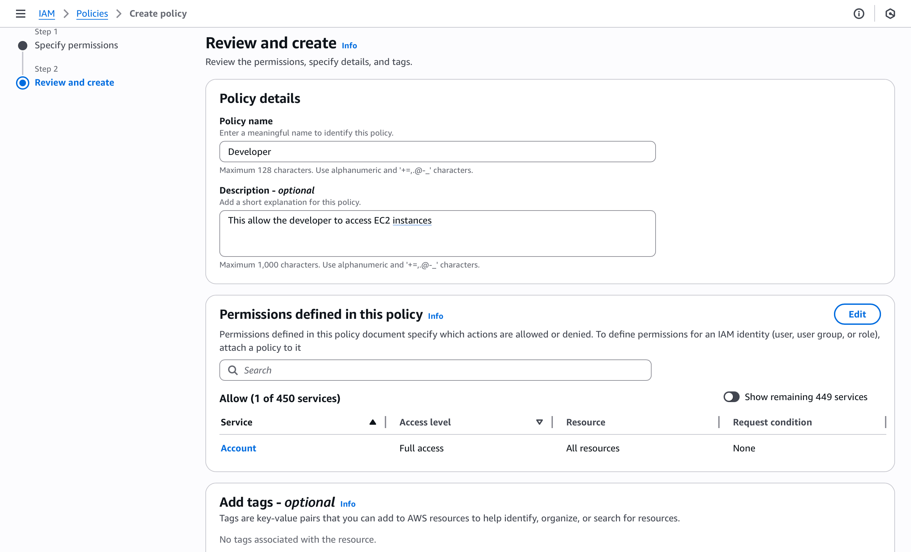

```Click on Create Policy.```

Once the policy has been created, use the ```search box``` in the IAM ```Policies``` section to look for the term ```Developer.``` The results will typically display two categories of policies:

- ```AWS Managed Policies``` – These are predefined by AWS and designed to cover common use cases. They provide a quick and convenient way to grant permissions without having to create a custom policy from scratch, though they may sometimes be broader than what is needed.

- ```Customer Managed Policies``` – These are the policies that you create and maintain within your own AWS account. They allow you to define permissions with greater precision, tailoring access controls to the exact needs of your organization, team, or role.
```
This distinction helps you understand whether a policy is standardized by AWS or custom-built for your specific environment, making it easier to manage permissions effectively.
```


## Create policy for the Data Analyst team
```
I then repeated the same process for the Data Analysts team, but instead of selecting EC2, I searched for and selected S3 as the service. This ensured that the policy being created was specifically tailored to grant permissions related to Amazon S3, allowing data analysts to view, create, and manage storage buckets and objects as required for their role.
```


## Create Group for the Development team
```
In the IAM console, navigate to the User groups section from the left-hand menu. Once there, click on the Create group button located at the top right of the page. This option allows you to define a new IAM group, which will serve as a container for users who share similar permissions. By creating groups, you can assign policies at the group level rather than individually, making it easier to manage access for multiple users with the same role.
```


When creating the group, provide ```a descriptive and role-specific name``` that clearly indicates its purpose. For example:
- ```Developer-Team``` for backend developers who require access to EC2 resources.

- ```Analyst-Team``` for data analysts who require access to S3 resources.
```
Using clear and consistent naming conventions makes it easier to manage groups, quickly identify their purpose, and ensure that users are added to the correct group as the organization grows.
```
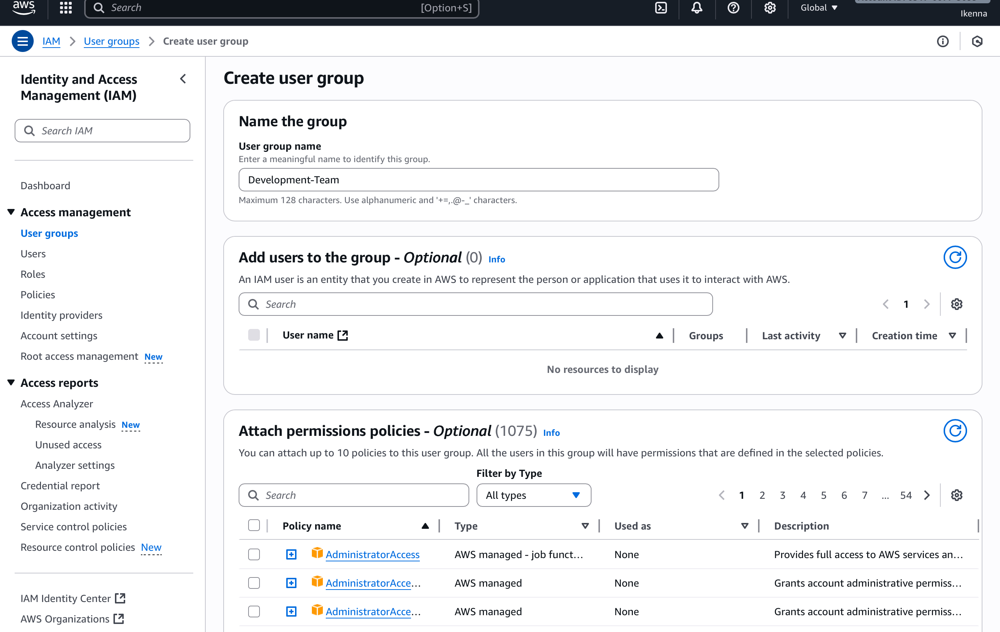

After naming the group, attach the ```Developer policy``` that was created earlier. Attaching this policy ensures that any user added to the ```Developer-Team group``` automatically inherits the permissions defined within it. In this case, members of the group will have access exclusively to ```EC2 instances```, which aligns with the responsibilities of backend developers. This approach simplifies permission management, as you only need to maintain the policy at the group level rather than assigning permissions individually to each user.


You have now successfully created a user group and attached the ```Developer policy``` to it. This means that any user added to this group will automatically inherit the permissions defined in the policy, granting them access exclusively to ```EC2 instances.``` It is important to note that this group is intended solely for ```backend developers,``` ensuring that their access is limited to the resources necessary for their role while maintaining adherence to the principle of least privilege.

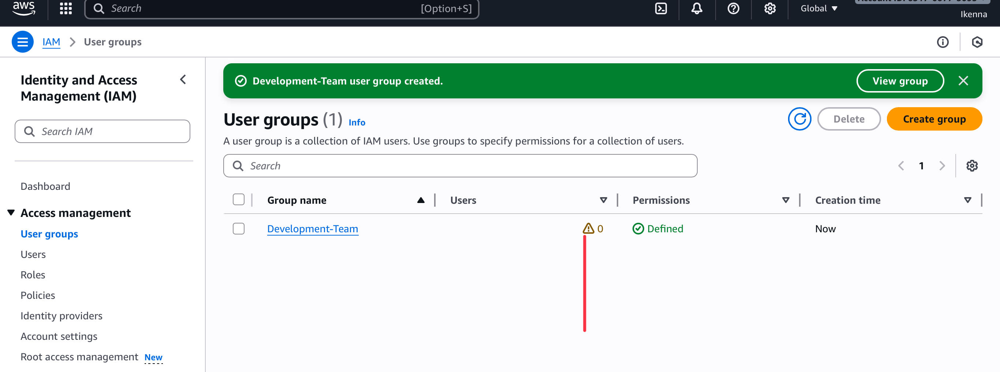

## Create Group for the Data Analysts team

I then repeated the same process for the `Data Analysts team` by creating a new group named `Analyst-Team.` Instead of attaching the `Developer policy`, I attached the Analyst policy that was created earlier. This policy grants access exclusively to `Amazon S3 services`, which aligns with the responsibilities of data analysts who work with data storage and management. As a result, any user added to the `Analyst-Team` group will automatically have the necessary permissions to interact with S3 resources, and nothing beyond that. This ensures that only data analysts are part of this group, maintaining a clear separation of access based on job roles.

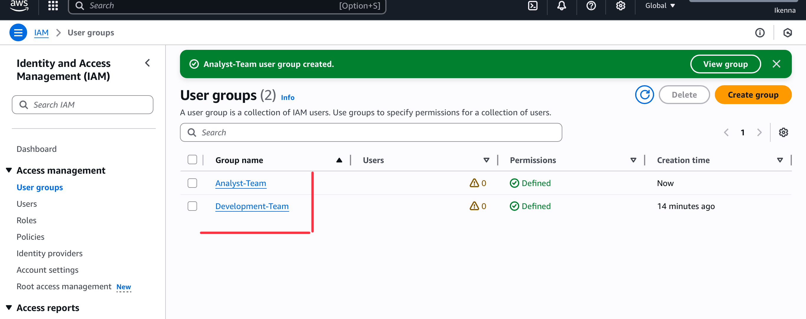

## Creating IAM User for John

Since `John is a backend developer`, he needs to be added as a user under the `Development-Team` group so that he automatically inherits the appropriate EC2 permissions.

To do this, navigate to the `IAM dashboard` in the AWS Management Console, select `Users` from the left-hand menu, and then click on `Create user`. This will start the process of setting up John’s IAM account, where you can define his username, configure access settings, and later assign him to the correct group.

```
When creating the user, carefully review the highlighted sections in the setup screen.
```
- `Provide the username`: In this case, enter `“John”` as the user’s name. This identifier will be used to log in and track activity associated with his account.
  
- `Enable AWS Management Console access`: Make sure to select the option that allows the user to access the `AWS Management Console`. Without this option enabled, John would not be able to sign in through a web browser and use the console interface.
```
This ensures that John is properly set up with the correct username and has the necessary access to log in and perform his backend development tasks.
```
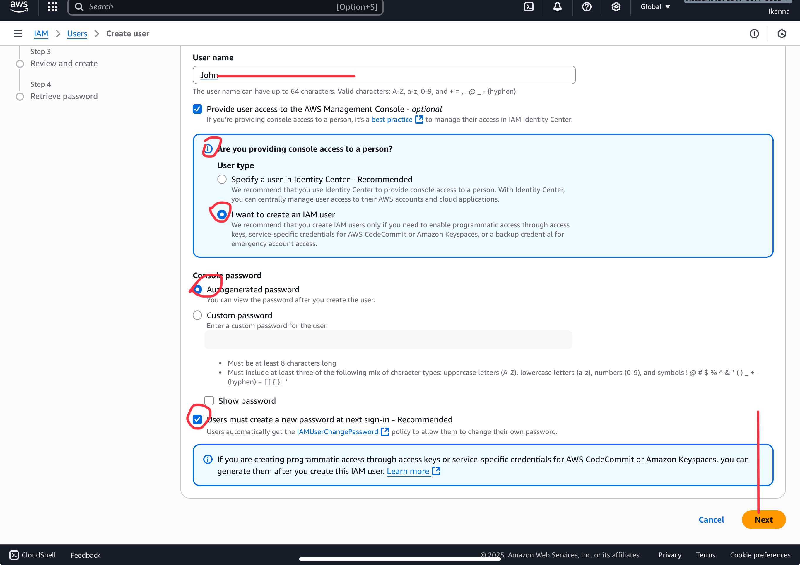

`Permissions`: During the user creation process, add John to the `Development-Team` group. By doing this, John will automatically inherit all the permissions attached to the group, specifically the `Developer policy` that grants access to `EC2 instances`. 
```
Assigning permissions through the group ensures consistency, simplifies management, and aligns John’s access with his role as a backend developer without needing to configure individual permissions manually.
```
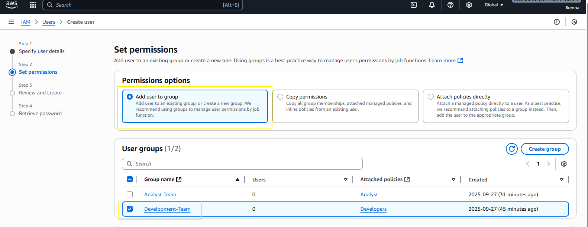

- Click on Create user
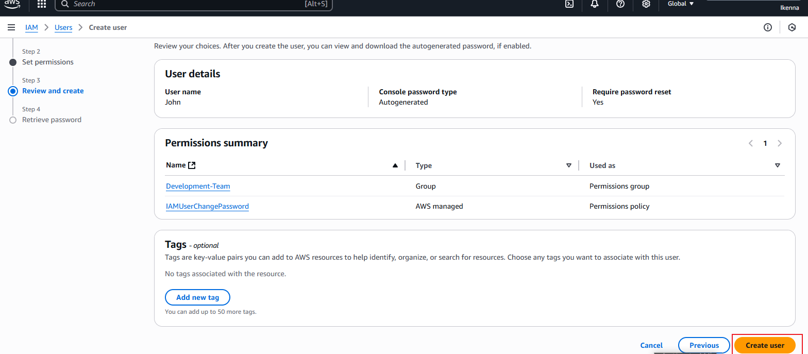

After completing John’s user setup and assigning him to the `Development-Team` group, download his `login credentials`. This typically includes a `CSV file` containing his username, initial password, and the URL for signing into the AWS Management Console. Storing this file securely is important, as it provides John with the necessary information to access his account for the first time. Ensure the credentials are shared safely and follow your organization’s security guidelines
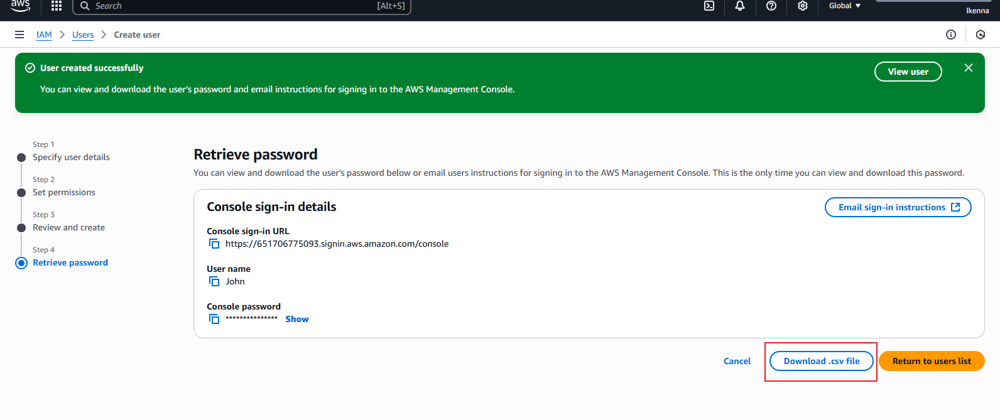

## Creating IAM User for Mary

I repeated the same process for `Mary`, taking into account that her role is `Data Analyst`. This involved creating a new IAM user for her and adding her to the `Analyst-Team` group so that she automatically inherits the permissions defined in the `Analyst policy,` which grants access to `S3 resources`. After successfully creating her account and assigning her to the group, I downloaded her `.csv file` containing her login credentials. This file will be used by Mary to log in to the AWS Management Console for the first time and securely access the resources required for her role.
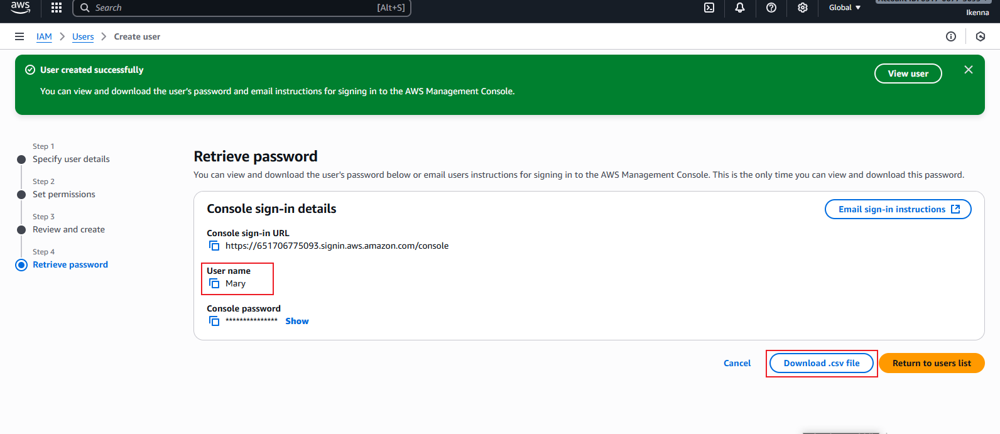

# Testing and Validation

## Testing John's Access

- First, log in to the AWS Management Console using John’s credentials. This step verifies that his account is active, functional, and able to access the system as intended for an IAM user.

- Next, navigate to the EC2 Dashboard within the console. Since John’s role as a backend developer involves deploying and managing servers, he should have visibility of EC2 resources and the ability to interact with them.

- Finally, test John’s EC2 permissions by attempting to launch a new instance or modify an existing one. Successfully performing these actions confirms that his IAM account has been correctly configured with the appropriate policies, ensuring he has the necessary access rights to carry out his backend development tasks.

## Testing Mary's Access

- Begin by logging into the AWS Management Console using Mary’s credentials. This step verifies that her account is active and functioning as expected, while also confirming that she can access the system with the permissions assigned to her role.

- Once logged in, navigate to the S3 Dashboard. As a Data Analyst, Mary’s responsibilities involve accessing, analyzing, and managing data stored in S3 buckets. Therefore, she should be able to view existing buckets as well as create and manage new ones.

- To validate her permissions, attempt key S3 actions, such as creating a new S3 bucket or uploading files to an existing one. If Mary is able to successfully complete these actions, it confirms that her IAM user account has been correctly configured with the necessary policies to support her work as a Data Analyst.

## Validating Group Policies
```
For both John and Mary, it is important to verify that their access is restricted strictly to the resources required by their respective roles—EC2 instances for John and S3 buckets for Mary. They should not be able to access any other AWS services or resources outside of what their assigned group policies allow. Conducting this validation confirms that the principle of least privilege is being followed, which is a key security practice. By limiting each user’s permissions to only what is necessary for their specific responsibilities, the risk of accidental or unauthorized access is minimized, thereby enhancing the overall security of the AWS environment.
```
## Implementing Multi-Factor Authentication (MFA)

- After creating new users, the next step is to add an extra layer of security with Multi-Factor Authentication (MFA).

- What is MFA: MFA is a security feature that requires users to provide two forms of verification before accessing AWS. This usually includes the standard username and password plus a one-time code from an MFA device or app.

- `Example` – John (Backend Developer):
- John logs into the AWS Management Console to work with EC2 instances. To strengthen security, Zappy e-Bank requires him to use MFA. This means: 
- John enters his username and password.
- AWS then prompts him for a one-time code generated by his MFA device.
```
This process ensures that even if John’s password is compromised, unauthorized users cannot access his account without the second authentication factor.
```
## Setting up MFA for John
`
- In the `IAM console`, navigate to the `Users` section from the left-hand menu, and then click on `John` to open his user details. This step assumes that John’s IAM user account has already been created. Accessing his user profile allows you to review or modify his account settings, permissions, group memberships, and security credentials as needed.
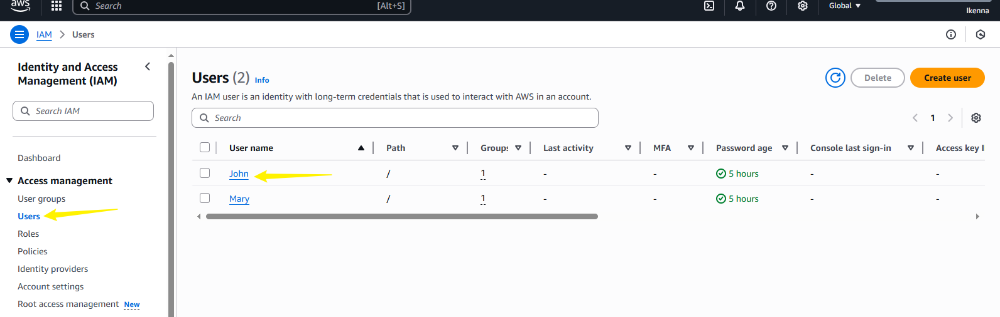

- In John’s user details page, click on the `MFA (Multi-Factor Authentication)` option as shown in the image below. This section allows you to enable additional security for John’s account by requiring a second authentication factor during login, which enhances account protection beyond just a username and password.
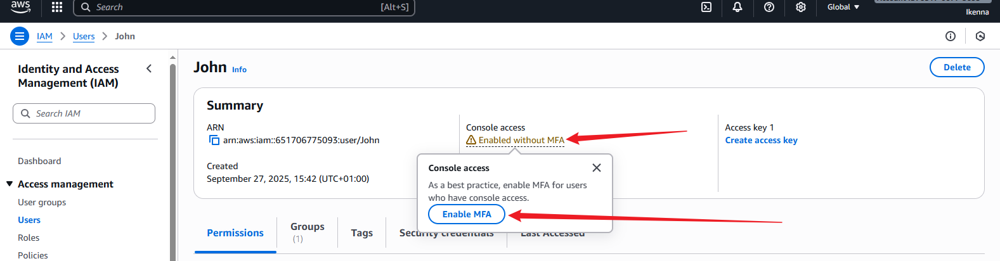

- In the `MFA setup` screen, enter a descriptive `device name` for John’s MFA device to help identify it later, such as `“John’s Authenticator”`. Then, select the option for `Authenticator App` as the MFA device type. This choice allows John to use a mobile authenticator app (like Google Authenticator or AWS MFA) to generate time-based one-time passwords (TOTP) for enhanced login security.
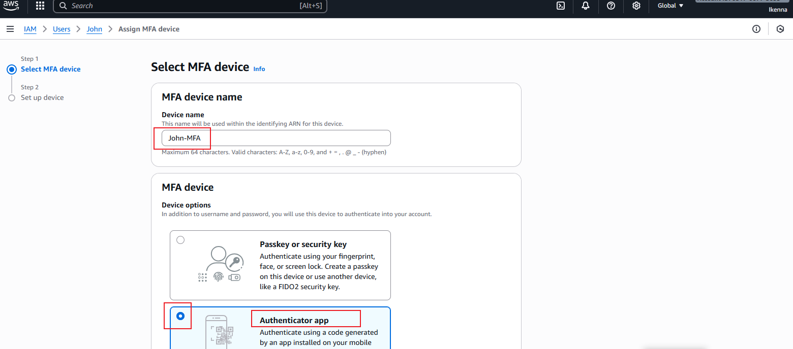

- `Note`: To set up MFA, you should have an authenticator app installed on your mobile device, such as `Google Authenticator` or `Microsoft Authenticator`. These apps generate time-based one-time passwords (TOTP) that will be used as a second layer of security when logging into the AWS Management Console. Make sure the app is installed and ready before proceeding with the MFA setup.

- Click on next.
- Open your `Google Authenticator` or `Microsoft Authenticator` app on your mobile device. Use the app to `scan the QR code` displayed on the AWS MFA setup screen. After scanning, the app will generate time-based one-time passwords (TOTP). Enter `two consecutive codes` from the app into the respective fields on the AWS console as shown in the image below to successfully activate MFA for John’s account.
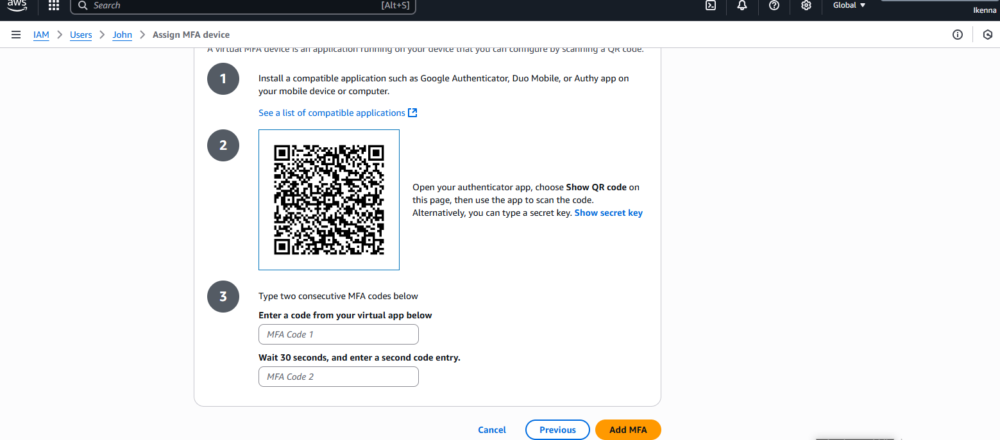

- By completing the previous steps, `Multi-Factor Authentication (MFA)` will be successfully enabled for John’s account. This means that John will now be required to provide a second authentication factor, generated by his authenticator app, in addition to his password when logging into the AWS Management Console. Enabling MFA significantly enhances the security of his account by protecting it against unauthorized access.
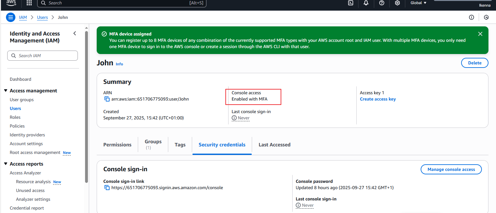

## Setting Up MFA for Mary
  
- I repeated the same process for `Mary`, successfully enabling `Multi-Factor Authentication (MFA)` on her account. This ensures that, like John, Mary will need to provide a second authentication factor from her authenticator app in addition to her password when logging into the AWS Management Console, enhancing the security of her account and protecting access to S3 resources.
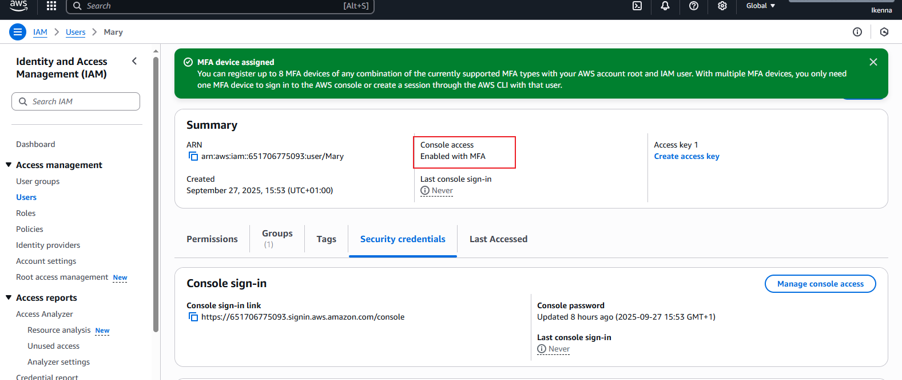

# Summary 

From this project we have been able to show that `Identity and Access Management (IAM)` in AWS helps control who can use your cloud resources and what they are allowed to do. You can create users, groups, and roles, giving each person only the permissions they need. Features like Multi-Factor Authentication (MFA) add extra security to protect important accounts.

IAM also makes managing access easier. By attaching permissions to groups or roles, administrators can quickly give the right access to multiple users at once. It allows control over specific services and resources, and tracks user activity for auditing and compliance. Overall, IAM keeps your AWS environment secure and organized.

Also, I was also able to differentiate between IAM Users and IAM Groups. An `IAM user` represents an individual person or service that needs access to your AWS account. Each user has a unique identity with their own credentials, such as a username, password for the AWS Management Console, and optionally, access keys for API or CLI access. Users are assigned `permissions directly or via group membership`, defining what they can do within AWS.

`Example`: You would create an IAM user for `John`, a backend developer, so he can log in with his own credentials and access EC2 instances. Each developer, analyst, or administrator generally gets their own IAM user to track individual activity and maintain security accountability.

Subsequently, an `IAM group` is a collection of IAM users that share the same permissions. Groups simplify permission management by allowing you to assign policies to multiple users at once rather than individually. A group itself does not have credentials and cannot log in; it only serves to manage permissions for its members.

Example: You would create a `Developer-Team` group for all backend developers and attach a policy granting access to EC2 instances. Any new developer added to this group automatically inherits the group’s permissions. Similarly, you could create an `Analyst-Team` group for data analysts with S3 access.

Also, I detailed the principle of least privilege. The `principle of least privilege` means giving users, groups, or roles `only the permissions they need to perform their tasks`—no more. In AWS IAM, this ensures users can access only the resources required for their role, such as EC2 for developers or S3 for analysts.

This principle is important for cloud security because it `reduces the risk of unauthorized access, prevents accidental changes`, and `simplifies auditing and compliance`. Following least privilege helps organizations manage access safely and efficiently while protecting critical resources.

Lastly, In this project, IAM was configured to match the roles of `John, a backend developer`, and `Mary, a data analyst`. John was added as a user to the `Developer-Team` group with the `Developer policy`, granting access only to `EC2 instances`. Mary was added to the `Analyst-Team` group with the `Analyst policy`, giving her access exclusively to `S3 resources`.

This setup aligns with each user’s job function and follows the `principle of least privilege,` ensuring that they have only the permissions necessary for their tasks. Using groups and role-based policies simplifies permission management, enhances security, and reduces the risk of unauthorized access.
